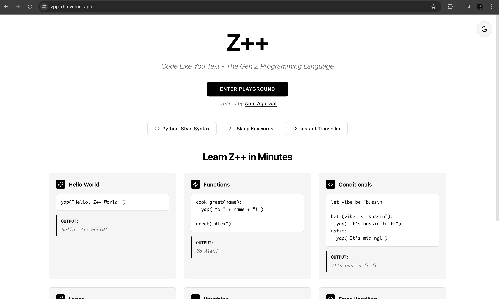
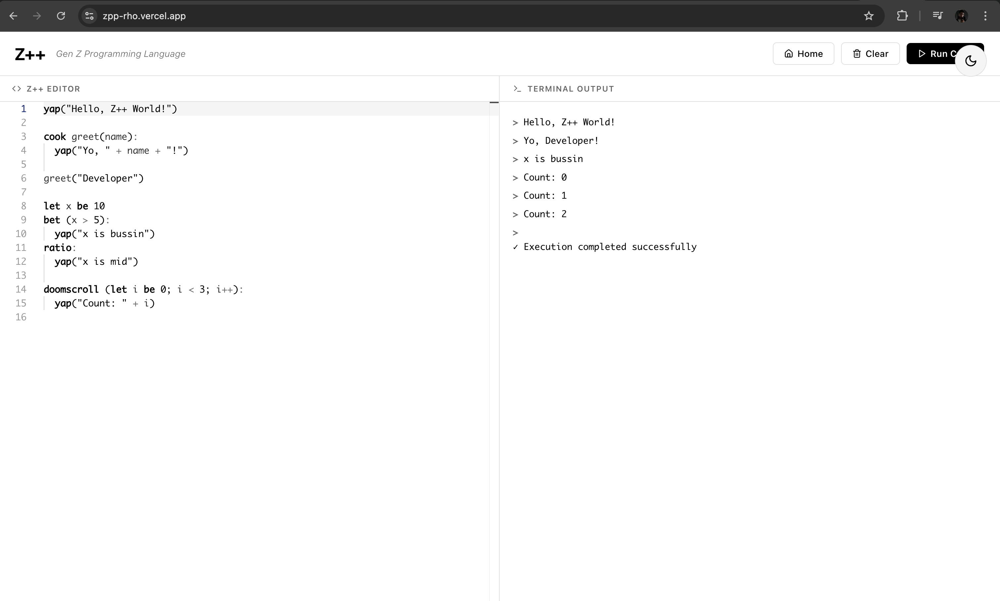

# Z++ (The Gen Z Programming Language) 💀


> **"Stop writing `print("Hello World")`. Start writing `yap("Hello World")`."**

**Z++** is an esoteric programming language (esolang) designed for the vibe check. It features a custom source-to-source transpiler that compiles Gen Z slang into executable JavaScript in real-time. It runs entirely in the browser via a custom-built IDE.

[**🔴 LIVE DEMO**](https://zpp-rho.vercel.app/)

---

## 📸 Screenshots

### The Landing Page

*(Note: Create a 'screenshots' folder in your repo and add your images there)*

### The Playground (Matrix Mode)


---

## ⚡ Features

* **Custom Transpiler:** A hand-written lexer and transpiler that maps Z++ syntax to JavaScript.
* **Python-Style Indentation:** Implements a stack-based state machine to parse significant whitespace (indentation) and convert it into block-scoped logic (`{}`).
* **Monaco Editor Integration:** Full-featured code editor with:
    * Custom Syntax Highlighting.
    * Intelligent Autocomplete for Z++ keywords.
* **Secure Execution:** Overrides browser console streams to capture output safely in a virtual terminal.

---

## 📚 Syntax Cheat Sheet

| Z++ Keyword | JavaScript Equivalent | Description |
| :--- | :--- | :--- |
| `yap` | `console.log` | Print output |
| `gimme` | `prompt` | Get user input |
| `bet` | `if` | Conditional check |
| `ratio` | `else` | Fallback condition |
| `grind` | `while` | While loop |
| `doomscroll` | `for` | For loop |
| `cook` | `function` | Define a function |
| `serve` | `return` | Return a value |
| `no_cap` | `true` | Boolean True |
| `cap` | `false` | Boolean False |
| `ragequit` | `break` | Break loop |
| `fuck_around` | `try` | Try block |
| `find_out` | `catch` | Catch block |

---

## 💻 Example Code

### 1. The Vibe Check (Conditionals)
```python
let vibe be no_cap

bet (vibe):
  yap ("We balling.")
ratio:
  yap ("It's so over.")
```

### 2. The Grind (Loops)
```python
let energy be 100

grind (energy > 0):
  yap ("Working... Energy: " + energy)
  energy be energy - 20

yap ("Burnout reached. Ragequitting.")
```

### 3. Error Handling
```python
fuck_around:
  yap ("Trying something risky...")
  crashout ("Oops")
find_out:
  yap ("Caught the L.")
```

---

## 🛠️ Installation & Setup

Want to run the compiler locally?

1.  **Clone the repo:**
    ```bash
    git clone https://github.com/AnujAga2005/zpp.git
    cd zpp
    ```

2.  **Install dependencies:**
    ```bash
    npm install
    ```

3.  **Run the dev server:**
    ```bash
    npm run dev
    ```

4.  **Open your browser:**
    Navigate to `http://localhost:5173`.

---

## 🧠 How It Works (Architecture)

This project is not just a regex replace. It involves a multi-stage compilation process:

1.  **Tokenization:** The source code is split into tokens, separating syntax characters (like `{}`) from string literals to ensure safety (e.g., `yap "Don't yap"` correctly identifies the command vs the string).
2.  **Indentation Parsing:** Since Z++ uses Python-style indentation but compiles to C-style JavaScript, the compiler uses a **Stack** to track indentation levels.
    * When indentation increases after a `:`, a `{` is injected.
    * When indentation decreases, the corresponding `}` is injected.
3.  **Transpilation:** Keywords are mapped to their JavaScript equivalents.
4.  **Execution:** The resulting string is executed within a sandboxed environment, with `console.log` and `console.error` hooked to redirect output to the UI terminal.

---

## 🤝 Contributing

Got a new slang word that needs to be added?
1.  Fork the repo.
2.  Add the keyword to `src/compiler.ts`.
3.  Submit a Pull Request.

---

**Created by [Anuj Agarwal](https://github.com/AnujAga2005)**
*Built with React, TypeScript, and Vibes.*
